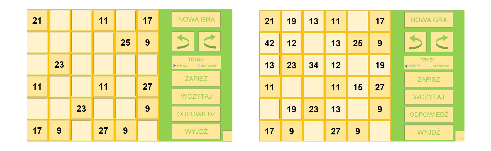

# Three Numbers - Puzzle Game

Only three different numbers should fill in the empty fields of the diagram in such a way that a magic square is formed: the sum of the numbers in each row, column and on each of the two diagonals should be equal to 100. 

Source of the project idea: http://archiwum.wiz.pl/2000/00035500.asp 

# Project includes:
- graphic interface
- user manual
- an algorithm that generates random solvable boards
- an algorithm that watches over the progress of the game
- undo and redo system
- save system
- simplified mode
- exemplary solution to the generated board
- blocking from entering unwanted symbols

Sample board:

Simplified mode turned on (left), window with genearated board with answer (center), window with instruction (right)

